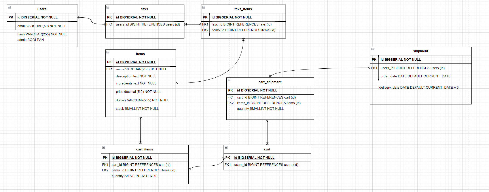

# ORANGE MART

An ecommerce app which enables users to purchase groceries at teh comfort of their homes.

Key technolgoies used:

|    **Frontend**     |    **Controller**           |               **Backend**            |
| ------------------- | --------------------------- | ------------------------------------ |
| React.js            | Express.js                  | Postgresql                           |
| Vanilla CSS         | Restful APIs                | (refer to SQL folder in Backend Repo)|
| Tailwind CSS        | HTTP requests - CRUD        |                                      |
| React Toastify      | User Authenticated Routes   |                                      |
|                     | - Non-User                  |                                      |
|                     | - Normal User               |                                      |
|                     | - Admin User                |

There is more emphasis on designing on the SQL database, which can be found [here](#database-tables--relationships). There is a need for a logger-service table to link data between connected users, although the project hasn't included that functionality as of now.

THe project also incoporates user authentication as well, through protected routes with the controller. The passwords are hashed with bcrypt, and access/refresh tokens are generated with Json Web Tokens (JWTs). However, the actual JWT log out is not implmented as of now.

## Users

There are 3 main types of users

**User Type**         |    **Non-Registered User**                    |            **Normal User**                |               **Admin User**            |
| ------------------- | --------------------------------------------- | ----------------------------------------- | --------------------------------------- |
| **Access**          | View gallery of items                         | All access rightsof a Non-Registered User | All access rights of a Normal User      |
|                     | Check item details like price and quantity    | Add item to favourites                    | View all user accounts                  |
|                     |                                               | View Favourites Page                      |                                         |
|                     |                                               | Add item to Cart                          |                                         |
|                     |                                               | View Cart                                 |                                         |
|                     |                                               | Proceed to pay item for shipment          |                                         |
|                     |                                               | Cancel Paid Order                         |                                         |

## Diagrams

#### Database tables & relationships

## Installation / Dependencies

#### Client:

1. npm i react-router-dom
2. npm install -D tailwindcss postcss autoprefixer
3. npx tailwindcss init -p
4. npm install --save react-toastify

#### Server:

1. npm init -y
2. npm i express nodemon
3. npm i pg cors dotenv
4. npm i jsonwebtoken bcrypt

_.env config:_

1. ACCESS_SECRET
2. REFRESH_SECRET

## Challenges & unsolved problems

**1. Database design**

Much time was put into constructing the tables and their relationships. However, it has be better optimised as this had created issues later on when creating the backend endpoints.

**2. User Authentication**

JWT was used to create the accesss token and to recognise a particular user's login. When creating the admin only endpoints, the user email is checked initially if its admin schema is true. If false, it will return and exit the endpoint.